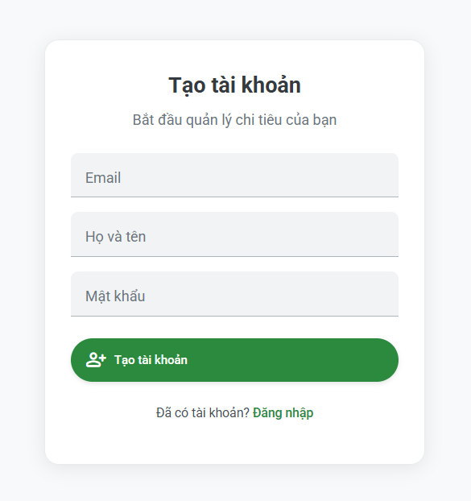
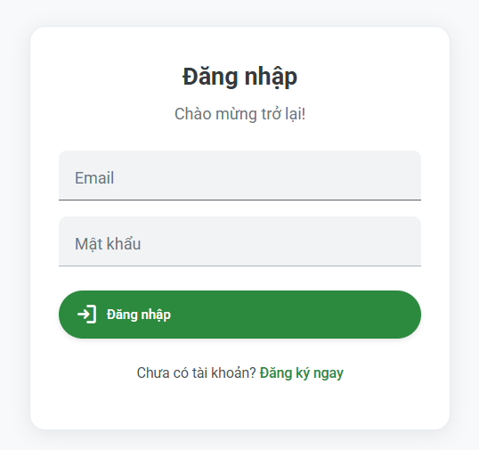
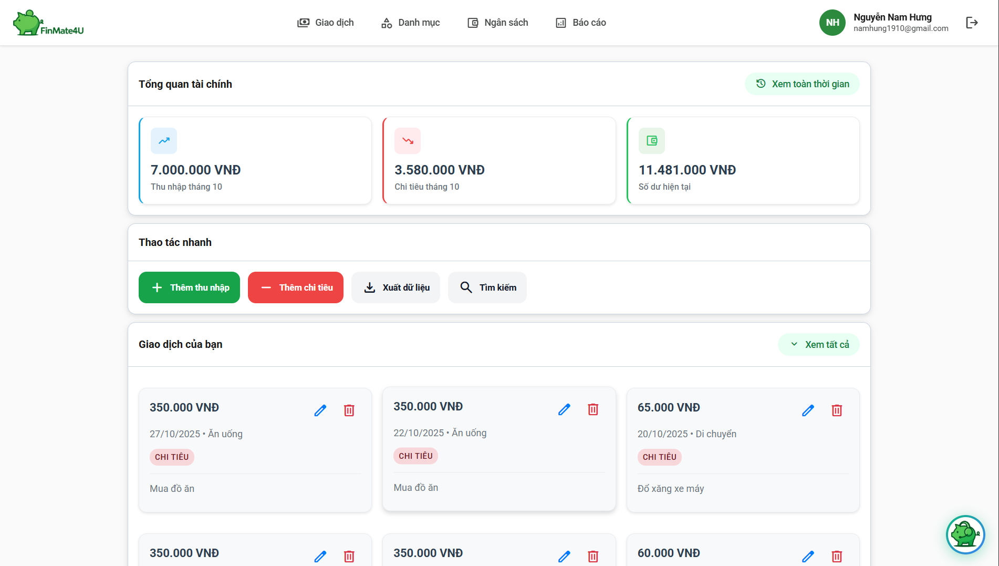
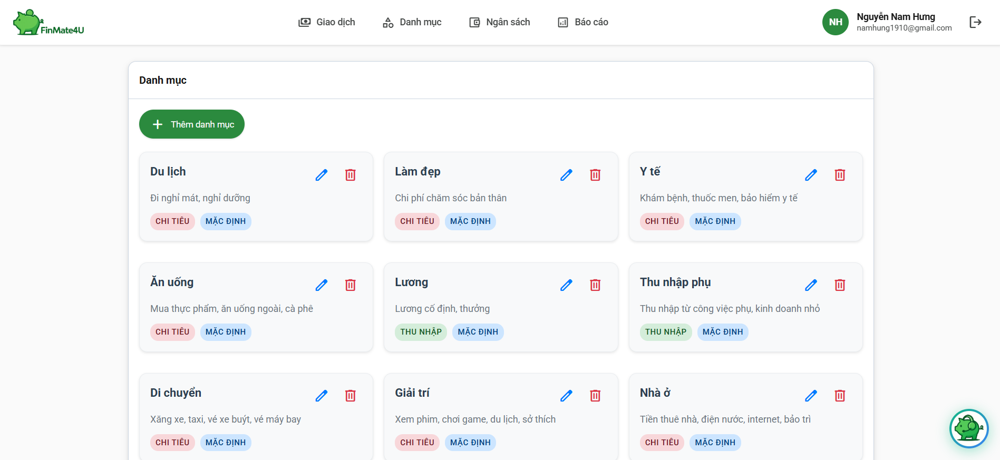
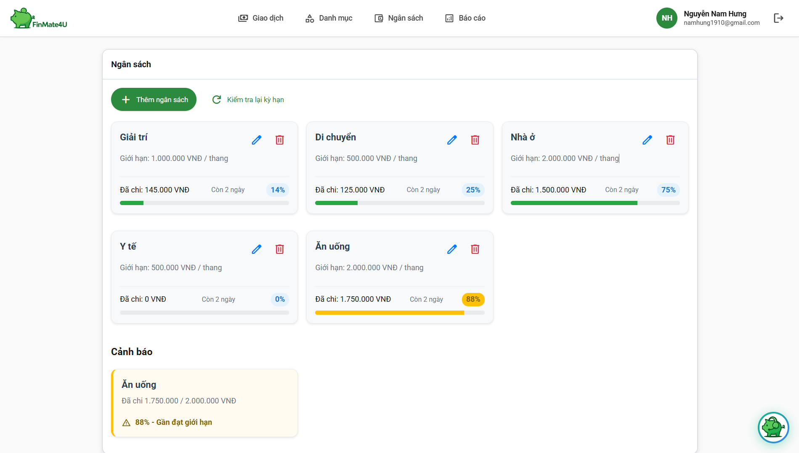
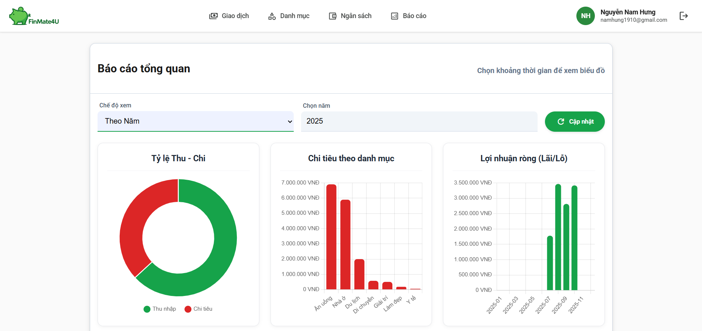
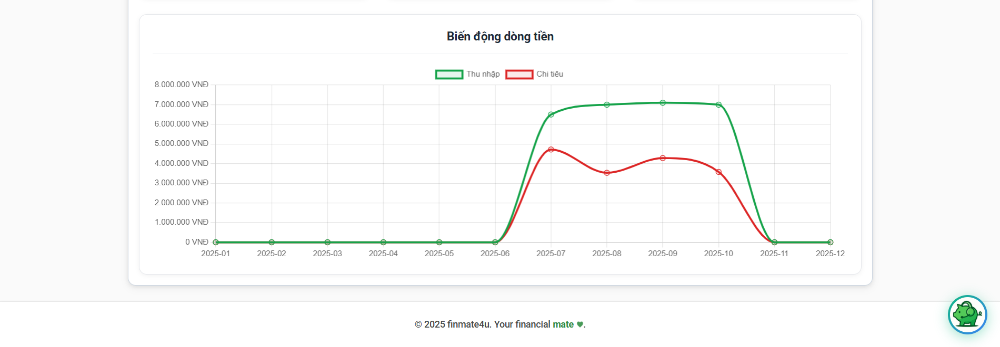
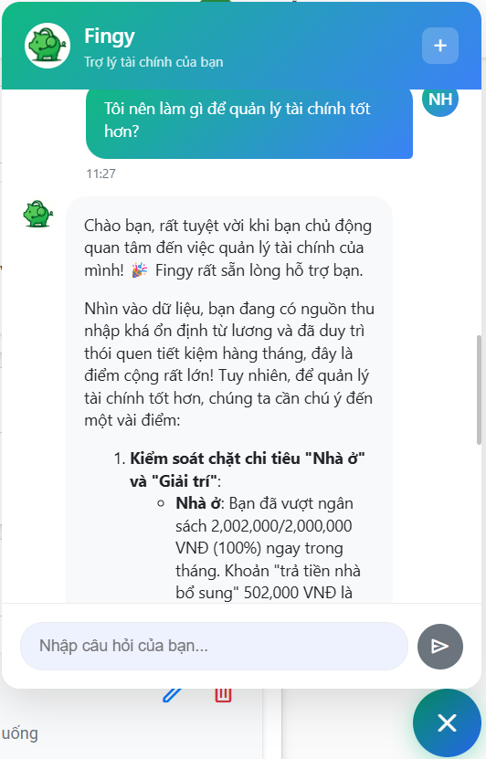

<h2 align="center">
    <a href="https://dainam.edu.vn/vi/khoa-cong-nghe-thong-tin">
    🎓 Faculty of Information Technology (DaiNam University)
    </a>
</h2>
<h2 align="center">
   PHÁT TRIỂN HỆ THỐNG QUẢN LÝ TÀI CHÍNH CÁ NHÂN THÔNG MINH DỰA TRÊN TRÍ TUỆ NHÂN TẠO
</h2>
<div align="center">
    <p align="center">
        
        
        
    </p>

[](https://www.facebook.com/DNUAIoTLab)
[](https://dainam.edu.vn/vi/khoa-cong-nghe-thong-tin)
[](https://dainam.edu.vn)

</div>

## 1. 📖 GIỚI THIỆU

**Finmate4U** là hệ thống quản lý tài chính cá nhân thông minh, được phát triển dưới dạng **ứng dụng web**, giúp người dùng theo dõi, kiểm soát và tối ưu hóa các quyết định tài chính của mình một cách dễ dàng và hiệu quả. Ứng dụng nổi bật với việc tích hợp **Trí tuệ Nhân tạo (AI)** thông qua Chatbot **Fingy**, mang đến trải nghiệm quản lý tài chính mang tính cá nhân hóa cao.

### ✨ Tính năng nổi bật:

* **Quản lý giao dịch chi tiết:**
    * Thêm mới và quản lý các giao dịch **Thu nhập** và **Chi tiêu**.
    * **Tìm kiếm chi tiêu** và **xuất dữ liệu** giao dịch ra tệp CSV.
* **Tổng quan và Số dư:**
    * Xem **Tổng quan Thu-Chi** cho toàn bộ thời gian và tháng hiện tại.
    * Theo dõi **Số dư** tài khoản cá nhân.
* **Quản lý Danh mục và Ngân sách:**
    * Quản lý các **Danh mục Chi tiêu** tùy chỉnh.
    * **Đặt và quản lý Ngân sách** theo tháng/năm.
    * Cảnh báo thông minh khi ngân sách **sắp đến hạn** hoặc **quá hạn**.
* **Báo cáo trực quan (Biểu đồ):**
    * Xem báo cáo tài chính theo **tuần, tháng, năm**.
    * Hiển thị qua **4 biểu đồ trực quan** bao gồm: Tỷ lệ Thu-Chi, Chi tiêu theo Danh mục, Lợi nhuận ròng (lãi/lỗ), và Biến động dòng tiền.
* **Trợ lý tài chính AI - Chatbot Fingy:**
    * Được xây dựng trên **Gemini 2.5 Flash** để phân tích dữ liệu.
    * Cung cấp thông tin **xu hướng chi tiêu** chính xác của người dùng.
    * Đưa ra **lời khuyên tài chính cá nhân hóa**.
    * Có khả năng **so sánh hiệu suất tài chính** giữa tháng này với các tháng trước, và hơn thế nữa.


## 2. 💻 CÔNG NGHỆ SỬ DỤNG
<p align="center">
  
  
  
  
</p>


## 3. 🚀 HƯỚNG DẪN CÀI ĐẶT
### 📋 Điều kiện tiên quyết
- Đã cài đặt **Node.js** và **npm**.
- Đã cài đặt MongoDB Community Server và đảm bảo bạn có công cụ dòng lệnh `mongorestore` sẵn có trong Terminal/CMD.
- Bạn cần có API Key của Gemini 2.5 Flash.

### 🔧 Các bước cài đặt

1. **Clone repository:**
    ```bash
    git clone https://github.com/namhung1910/QuanLyTaiChinhCaNhan
    cd QuanLyTaiChinhCaNhan
2. **Chuẩn bị dữ liệu:**
- Khởi động MongoDB và đảm bảo đang hoạt động tại `mongodb://localhost:27017/`.
- Sử dụng lệnh `mongorestore` để khôi phục dữ liệu mẫu.Hãy thay thế đường dẫn tới thư mục backup bằng đường dẫn thực tế của bạn:

        mongorestore --db quanlytaichincanhan đường-dẫn-đến-thư-mục-quanlytaichincanhanDBbackup\quanlytaichincanhan
- Ví dụ:

        mongorestore --db quanlytaichincanhan C:\Users\LENOVO\Documents\QuanLyTaiChinCaNhan\quanlytaichincanhanDBbackup\quanlytaichincanhan

📌 Lưu ý:
-	Tránh trùng lặp cơ sở dữ liệu: Trước khi thực hiện restore, hãy kiểm tra xem MongoDB đã có cơ sở dữ liệu tên **quanlytaichincanhan** chưa. Nếu có, bạn có thể gặp lỗi hoặc dữ liệu cũ có thể bị ghi đè.
-	Đảm bảo MongoDB đang chạy: Nếu MongoDB chưa được khởi động, lệnh `mongorestore` sẽ không hoạt động.
3. **Cấu hình môi trường(.env)**
- Tạo file `.env` mới trong thư mục `/server` (ngang hàng với `node_modules` và `src`).
- Sao chép khối code sau và thay đổi các thông tin:
    ```env
    # Database
    MONGODB_URI=mongodb://localhost:27017/quanlytaichincanhan
    # JWT
    JWT_SECRET=đặt một chuỗi khóa bất kỳ đủ mạnh của bạn
    #Client URL(Thay bằng cổng thực tế của bạn)
    CLIENT_URL=http://localhost:5173
    # Gemini AI API Key
    GEMINI_API_KEY=thay thế API Key của bạn vào đây
    
4. **Cài đặt và Khởi động Server:**
    ```bash
    cd server
    npm install
    npm run dev
5. **Cài đặt và Khởi động Giao diện:**
    ```bash
    # Hãy mở một terminal mới và chạy lệnh ở thư mục gốc
    npm install
    npm run dev
## 4. 📸 HÌNH ẢNH CHƯƠNG TRÌNH
- Giao diện đăng ký, đăng nhập của trang web:
    <p align="center">
    
    
    </p>
- Giao diện trang Giao dịch:
    <p align="center">
    
    </p>
- Giao diện trang Danh mục:
    <p align="center">
    
    </p>
- Giao diện trang Ngân sách:
    <p align="center">
    
    </p>
- Giao diện trang Báo cáo:
    <p align="center">
    
    
    </p>
- Giao diện Chatbot Fingy:
    <p align="center">
    
    </p>    

## 5. 📞 Liên hệ: 
Nếu có thắc mắc hoặc góp ý, vui lòng liên hệ qua <br> namhung1910@gmail.com

---
© 2025 Nhóm 11. All rights reserved.